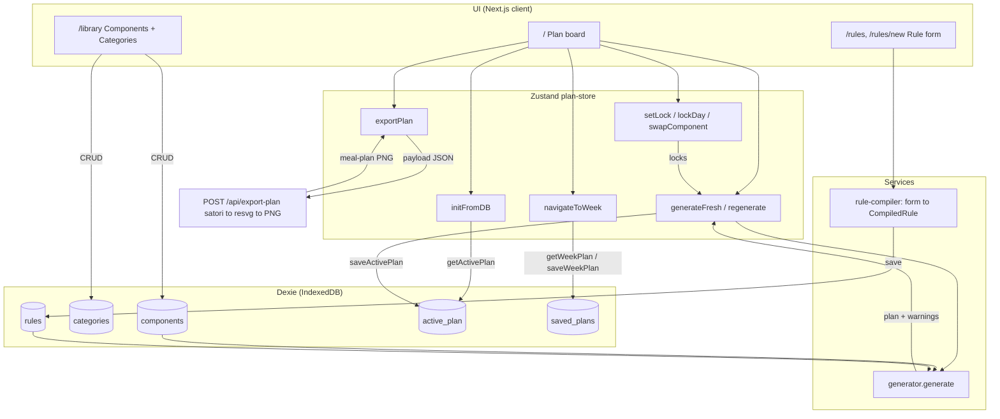
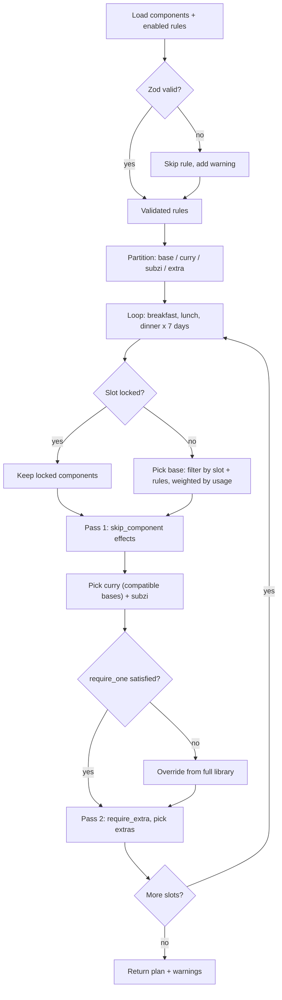

# Architecture

## App flow

```mermaid
flowchart TD
    subgraph UI["UI (Next.js client)"]
        Home["/ Plan board"]
        Lib["/library Components + Categories"]
        Rules["/rules, /rules/new Rule form"]
    end

    subgraph Store["Zustand plan-store"]
        Init["initFromDB"]
        Gen["generateFresh / regenerate"]
        Edit["setLock / lockDay / swapComponent"]
        Nav["navigateToWeek"]
        Exp["exportPlan"]
    end

    subgraph DB["Dexie (IndexedDB)"]
        Comps[("components")]
        Cats[("categories")]
        RulesT[("rules")]
        Active[("active_plan")]
        Saved[("saved_plans")]
    end

    subgraph Svc["Services"]
        Compile["rule-compiler: form to CompiledRule"]
        Generator["generator.generate"]
    end

    API["POST /api/export-plan satori to resvg to PNG"]

    Lib -->|CRUD| Comps
    Lib -->|CRUD| Cats
    Rules --> Compile -->|save| RulesT

    Home --> Init
    Init -->|getActivePlan| Active
    Home --> Gen
    Home --> Edit
    Home --> Nav
    Home --> Exp

    Gen --> Generator
    Comps --> Generator
    RulesT --> Generator
    Edit -->|locks| Gen
    Generator -->|plan + warnings| Gen
    Gen -->|saveActivePlan| Active
    Nav -->|getWeekPlan / saveWeekPlan| Saved
    Exp -->|payload JSON| API
    API -->|meal-plan PNG| Exp
```

## Generator (`src/services/generator.ts`)

```mermaid
flowchart TD
    A["Load components + enabled rules"] --> B{"Zod valid?"}
    B -->|no| W["Skip rule, add warning"]
    B -->|yes| C["Validated rules"]
    W --> C
    C --> D["Partition: base / curry / subzi / extra"]
    D --> E["Loop: breakfast, lunch, dinner x 7 days"]
    E --> L{"Slot locked?"}
    L -->|yes| K["Keep locked components"]
    L -->|no| F["Pick base: filter by slot + rules, weighted by usage"]
    K --> G
    F --> G["Pass 1: skip_component effects"]
    G --> H["Pick curry (compatible bases) + subzi"]
    H --> I{"require_one satisfied?"}
    I -->|no| J["Override from full library"]
    I -->|yes| M
    J --> M["Pass 2: require_extra, pick extras"]
    M --> N{"More slots?"}
    N -->|yes| E
    N -->|no| O["Return plan + warnings"]
```
